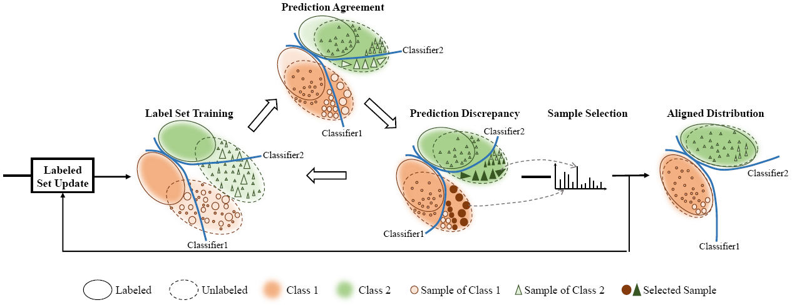
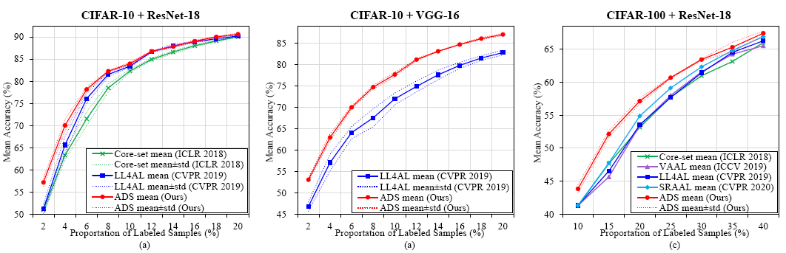
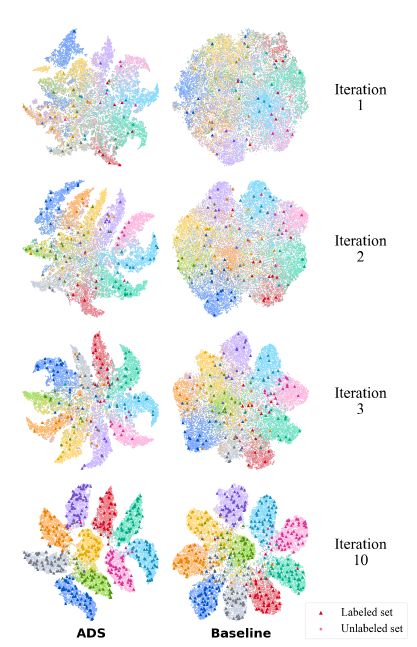

# AAAI21-ADS
Agreement-Discrepancy-Selection: Active Learning with Progressive Distribution Alignment

Codes are in the branch named "code"

Link to codes:

https://github.com/fumengying19/AAAI21-ADS/tree/code

# ADS
Agreement-Discrepancy-Selection: Active Learning with Progressive Distribution Alignment，in AAAI 2021
## Introduction
We propose an Agreement-Discrepancy-Selection (ADS) approach, and target at unifying the model training with sample selection by introducing adversarial classifiers atop a
convolutional neural network (CNN). Minimizing classifiers’ prediction discrepancy (maximizing their prediction agreement) drives learning CNN features to align the distributions of labeled and unlabeled samples. Maximizing classifiers’ discrepancy highlights informative samples by an entropy-based sample selection metric. Iterative prediction agreement-discrepancy progressively aligns the distributions of labeled and unlabeled sets in a progressive distribution alignment fashion for active learning.

## Getting started
### Install
1. Clone this repo:

    ~~~
    ADS_ROOT=/path/to/clone/ADS
    git clone --recursive https://github.com/fumengying19/AAAI21-ADS/tree/code $ADS_ROOT
    cd $ADS_ROOT
    ~~~
  
2. Create an Anaconda environment：

  torch >= 1.1.0

  numpy >= 1.16.2

3. Dataset
    cifar10, cifar100
    
    
### Train and test
- Train
    ~~~
    python main_ADS.py
    ~~~
    
 
 ## Visualization
 
 
 

 ## Acknowledgement
This work was supported in part by National National Natural
Science Foundation of China (NSFC) under Grant
61836012, 61771447 and 62006216, Strategic Priority Research
Program of Chinese Academy of Science under Grant
XDA27010303, and Post Doctoral Innovative Talent Support
Program of China under Grant 119103S304.

 ## Citation
 Please consider citing our paper in your publications if the project helps your research.
 ~~~
 @inproceedings{fumengyingAAAI21,
  title={Agreement-Discrepancy-Selection: Active Learning with Progressive Distribution Alignment},
  author={Mengying Fu, Tianning Yuan, Fang Wan, Songcen Xu, Qixiang Ye},
  booktitle={Association for the Advancement of Artificial Intelligence},
  year={2021}
}
~~~
